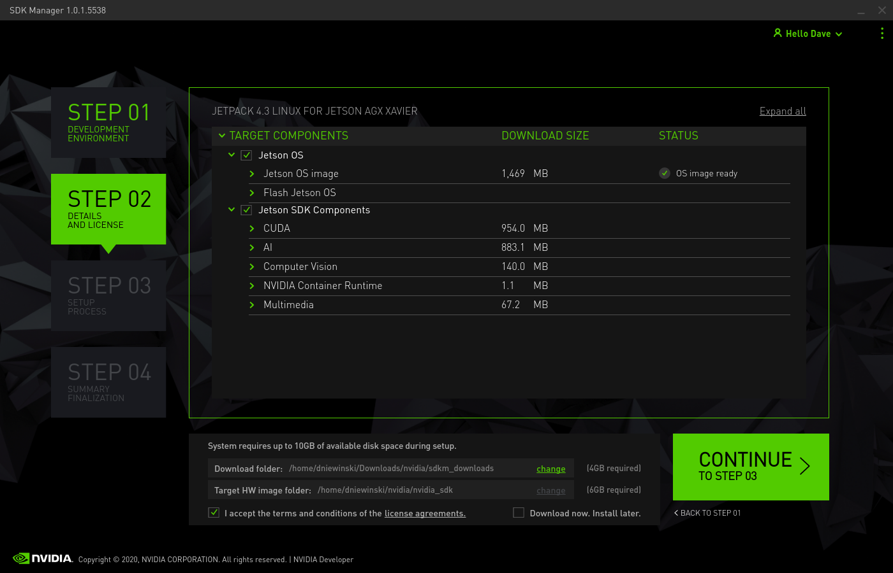
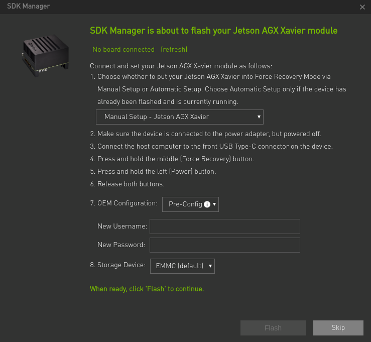

# Setup of clearpath husky robot
This repository contains instructions to setup clearpath husky with Ubuntu 20.04 installed on a Nvidia Jetson Xavier NX Zed Box. To do the setup proceed in the following manner:  
* First install Ubuntu 20.04 operating systems on Nvidia Jetson Xavier NX Zed Box.
* Then install Husky software from clearpath from source as mention in the installation steps below. This has to be done to allow the husky and zed box to communicate with each other.
* Answers to certain issues that might arise during the installation are addressed here.

# Ubuntu 20.04 installation on Nvidia Jetson Xavier NX Zed Box
Initially we have to install Ubuntu 20.04 operating systems on the zed box. A reference to the installation process can be found here: https://docs.nvidia.com/sdk-manager/install-with-sdkm-jetson/index.html 
* Download SDK from: https://developer.nvidia.com/sdk-manager on the host PC.
* Connect the host PC to the Jetson board. (The board can be ON or OFF)
* Start the SDK manager on the host PC.
* Step 1:  
  ![Step_1][Images/jetson-step1-mid.png]
    * The jetson device should automatically detected. Your host PC OS should also be automatically detected. If not you can manually select it from the device dropdown list.
    * Select the required jetpack version.
    * You can deselect the Host Machine option in Step 1, as the components need not be installed in the host PC for the target board to function.
* Step 2:  
  
* You can select the components to be downloaded in the Step 2.
* Step 3:  
  
  * Continue with Step 3 to install the components and choose Manual setup as shown in the Figure below. Keep the storage device as EMMC. If you change it to NVME the flash will not be sucessful. It will give errors when trying to boot the Nvidia jetson.
  
* After the flash process is complete, do not shut  the installation process, but do not continue with it either, instead connect the zed box to a monitor and keyboard.
* Run the script file. This will change the memory from emmc to main memory.
* Once the script has completed its procedure, reboot the jetson and continue with the installation process.
Ubuntu 20.04 will be installed on Nvidia jetson at the end of the process

Reference:
Nvidia jetson installation: https://docs.nvidia.com/sdk-manager/install-with-sdkm-jetson/index.html   
Clearpath robotics: https://www.clearpathrobotics.com/assets/guides/melodic/husky/jetson_xavier.html

# Husky software setup
* Once the jetson has been configured with the software, we will begin to install husky packages.
* In order to prepare the installation of the husky software execute the following command in a terminal window and follow the instructions as they appear in the terminal
  ``` wget -c https://raw.githubusercontent.com/clearpathrobotics/ros_computer_setup/main/install.sh
      bash install.sh ```
* There might be a situation were ROS may not be installed. In such a case install ROS from the following link: http://wiki.ros.org/noetic/Installation/Ubuntu
* The husky package for noetic is not yet available as a .bin file. Hence it has to be installed from source from this github repository: https://github.com/husky/husky_robot.git
* Create the workspace
  ```  cd mkdir -p catkin_ws/src 
       cd catkin_ws/src 
       git clone https://github.com/husky/husky_robot.git 
* Remove husky tests from the package.xml file
* Build workspace
    ```cd ~/catkin_ws/ rosdep install --from-paths src --ignore-src -r -y 
       sudo apt install python3-catkin-tools python3-osrf-pycommon 
       catkin_make
* Add setup to the source on terminal startup   
      ` echo 'source ~/catkin_ws/devel/setup.bash'>>~/.bashrc source ~/.bashrc `
* **Note:** If you get errors in Spinnaker.h library, follow the Spinnaker library installation section given below
  

# Debugging serial cable connections issues between husky robot and zed box jetson xavier NX
* Add the following command to `/etc/ros/setup.bash `  
  `export HUSKY_PORT=/dev/ttyUSB0`
* Modify prolific rule:
  ```sudo nano /etc/udev/rules.d/50-husky-mcu.rules
     # Udev rule for the Prolific Serial-to-USB adapter shipped standard with Husky
     SUBSYSTEMS=="usb", ATTRS{manufacturer}=="Prolific*", SYMLINK+="prolific prolific_$attr{devpath}", MODE="0666"```
* Reload the rules file
  ```sudo udevadm control --reload-rules  
     sudo udevadm trigger 

# Spinnaker library installation
* Uninstall old spinnaker libraries  
  `sudo apt-get remove libspinnaker*; sudo apt-get autoremove`
* Download libspinnaker 2.6.0 from the given URL. For jetson download the arm64 archive  
  `https://packages.clearpathrobotics.com/stable/flir/Spinnaker/Ubuntu20.04/`
* Extract it onto the jetson
* Open the folder in which you have extracted the spinnaker to in the terminal and run the following command
  `./install_spinnaker_arm.sh`
* Clone the noetic-devel branch of https://github.com/ros-drivers/flir_camera_driver to the src folder of the worspace
* Remove the build and devel in the ROS workspace
* Rebuild the workspace with `catkin_make`

