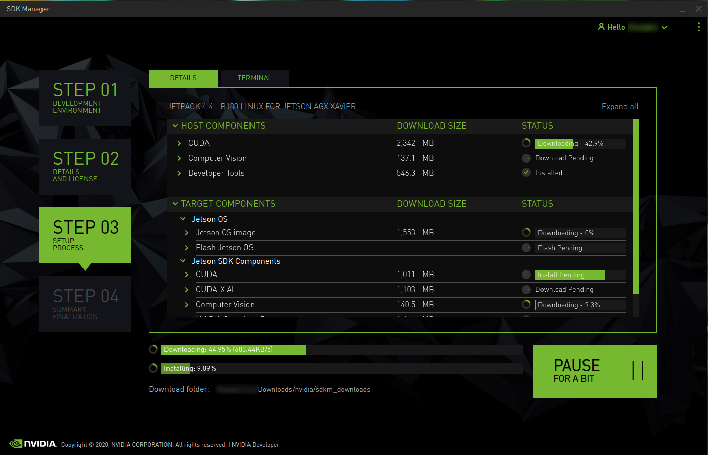

# Setup of clearpath husky robot
This repository contains instructions to setup clearpath husky with Ubuntu 20.04 installed on a Nvidia Jetson Xavier NX Zed Box. To do the setup proceed in the following manner:  
* First install Ubuntu 20.04 operating systems on Nvidia Jetson Xavier NX Zed Box.
* Then install Husky software from clearpath from source as mention in the installation steps below. This has to be done to allow the husky and zed box to communicate with each other.
* Answers to certain issues that might arise during the installation are addressed here.

# Ubuntu 20.04 installation on Nvidia Jetson Xavier NX Zed Box
Initially we have to install Ubuntu 20.04 operating systems on the zed box. A reference to the installation process can be found here: https://docs.nvidia.com/sdk-manager/install-with-sdkm-jetson/index.html 
* Download SDK from: https://developer.nvidia.com/sdk-manager on the host PC.
* Connect the host PC to the Jetson board. (The board can be ON or OFF)
* Start the SDK manager on the host PC.
* Step 1:  
  
    * The jetson device should  be automatically detected. Your host PC OS should also be automatically detected. If not, you can manually select it from the device dropdown listas shown in the above figure..
    * Select the required jetpack version.
    * You can deselect the Host Machine option in Step 1, as the components need not be installed in the host PC for the target board to function.
* Step 2:  
  
* You can select the components to be downloaded in the Step 2.
* Step 3:  
  
  * Continue with Step 3 to install the components and choose Manual setup as shown in the Figure below. Keep the storage device as EMMC. If you change it to NVME the flash will not be sucessful. It will give errors when trying to boot the Nvidia jetson.
  
* After the flash process is complete, do not shut  the installation process, but do not continue with it either, instead connect the zed box to a monitor and keyboard.
* Run the script file move_rootfs.sh provided in this github. This will change the memory from emmc to main memory.
* Once the script has completed its procedure, reboot the jetson and continue with the installation process.
Ubuntu 20.04 will be installed on Nvidia jetson at the end of the process

Reference:
Nvidia jetson installation: https://docs.nvidia.com/sdk-manager/install-with-sdkm-jetson/index.html   
Clearpath robotics: https://www.clearpathrobotics.com/assets/guides/melodic/husky/jetson_xavier.html

# Husky software setup
* Once the jetson has been configured with the software, we will begin to install husky packages.
* In order to prepare the installation of the husky software execute the following command in a terminal window and follow the instructions as they appear in the terminal  
  `wget -c https://raw.githubusercontent.com/clearpathrobotics/ros_computer_setup/main/install.sh`  
  `bash install.sh`
* Reboot the husky after the script finishes executing.
* If you do not have interent connectivity after the reboot of the jetson check **Internet Connectivity** section to solve it.
* To check if ROS is installed run the command `roscore` in a terminal. If ROS is not installed it will give an error. In such a case install ROS from the following link: http://wiki.ros.org/noetic/Installation/Ubuntu
* To see that the Husky is connected by opening a terminal and executing `rostopic echo /status`. A 1hz message containing the Husky’s diagnostic information shoul be displayed. If the message is not being displayed then first you will have to install the husky packages from source as mention below.
* The husky package for noetic is not yet available as a .bin file. Hence it has to be installed from source from this github repository: https://github.com/husky/husky_robot.git
* Create the workspace
  ```  cd mkdir -p catkin_ws/src 
       cd catkin_ws/src 
       git clone https://github.com/husky/husky_robot.git 
* Remove husky_tests from the package.xml file
* Build workspace
    ```cd ~/catkin_ws/ rosdep install --from-paths src --ignore-src -r -y 
       sudo apt install python3-catkin-tools python3-osrf-pycommon 
       catkin_make
* Add setup to the source on terminal startup   
      ` echo 'source ~/catkin_ws/devel/setup.bash'>>~/.bashrc source ~/.bashrc `
* **Note:** If you get errors in Spinnaker.h library, follow the Spinnaker library installation section given below
* Once the build is complete run the following command: `rosrun husky_bringup install`. Follow the on screen instructions. Restart the jetson.
* The COMM light on the jetson should turn green. If it is not green run the command: `sudo journalctl -u ros`. It should give some hint of the error.
  

# Debugging serial cable connections issues between husky robot and zed box jetson xavier NX
If the COMM light of the husky is RED after performing the following steps might help.
* Add the following command to `/etc/ros/setup.bash `    
  `export HUSKY_PORT=/dev/ttyUSB0`
* Modify prolific rule:  
  `sudo nano /etc/udev/rules.d/50-husky-mcu.rules`
* Udev rule for the Prolific Serial-to-USB adapter shipped standard with Husky  
     `SUBSYSTEMS=="usb", ATTRS{manufacturer}=="Prolific*", SYMLINK+="prolific prolific_$attr{devpath}", MODE="0666"`
* Reload the rules file  
  `sudo udevadm control --reload-rules`  
  `sudo udevadm trigger`

# Spinnaker library installation
Follow these instructions if you are getting errors regarding Spinnaker.h when trying to build the husky packages
* Uninstall old spinnaker libraries  
  `sudo apt-get remove libspinnaker*; sudo apt-get autoremove`
* Download libspinnaker 2.6.0 from the given URL. For jetson download the arm64 archive https://packages.clearpathrobotics.com/stable/flir/Spinnaker/Ubuntu20.04/ 
* Extract it onto the jetson
* Open the folder in which you have extracted the spinnaker to in the terminal and run the following command
  `./install_spinnaker_arm.sh`
* Clone the noetic-devel branch of https://github.com/ros-drivers/flir_camera_driver to the src folder of the worspace
* Remove the build and devel in the ROS workspace
* Rebuild the workspace with `catkin_make`

# Internet connectivity 
* To resolve internet connectivity issue follow this article: https://askubuntu.com/questions/1039233/no-wired-connection-wired-unmanaged-ubuntu-18-04 or this https://forum.linuxconfig.org/t/wired-unmanaged-ubuntu-desktop-issue/1574 (this is more specific)
* Go to `/etc/netplan/` and open the .yaml file using a text editor (Eg. nano, gedit).
* Add or change `renderer: networkd` to `renderer: NetworkManager`
* Then run `sudo netplan apply`
* This should enable ethernet connections in the network nettings

# Velodyne installation
* Make sure you have a functioning ethernet connection by following **Internet connectivity** section.
* The reference to velodyne installation can be found here: http://wiki.ros.org/velodyne/Tutorials/Getting%20Started%20with%20the%20Velodyne%20VLP16
* Initially you will have to find out the IP address of your velodyne to set it up in the ethernet configuration. For this you can use WireShark. Connect the velodyne to the target device and run wireshark. You should see the IP address on which the velodyne is broadcasting.
* Follow the instructions given in http://wiki.ros.org/velodyne/Tutorials/Getting%20Started%20with%20the%20Velodyne%20VLP16 to install the velodyne drivers.
* To obtain data from the velodyne run: `roslaunch velodyne_pointcloud VLP16_points.launch`
* Sometimes you might face an error where the script might stop working. In such cases, run the command again. We have observed that this is caused as another script is already running in /home/.rosd in the velodyne folder. You can choose to deactivate the velodyne script by commenting out a few lines which lead to the launch of vlp 16 on start-up.

# Microstarin IMU configuration
* To use Microstrain IMU you will require the Microstarin Inertial Driver
* You can install the driver from the given link: https://github.com/LORD-MicroStrain/microstrain_inertial
* The command to install is `sudo apt-get update && sudo apt-get install ros-ROS_DISTRO-microstrain-inertial-driver` (here ROS_DISTRO = noetic)
* To enable the IMU to collect the data run: `roslaunch microstrain_inertial_driver microstrain.launch`
* You can access data from the rostopics pertaining to the IMU. For more information, please refer to https://github.com/LORD-MicroStrain/microstrain_inertial

# Troubleshooting
* To check connectivity of the sereial cable run the following command:
  `ls -l /dev/ | grep prolific`
  If there is no output, there might be a possibility that the serial cable is faulty. The required serial cable: https://www.startech.com/en-us/cards-adapters/icusb232sm3 .
* After making changes to `/etc/ros/setup.bash ` for any given case, run `rosrun husky_bringup install` and restart the target device.

